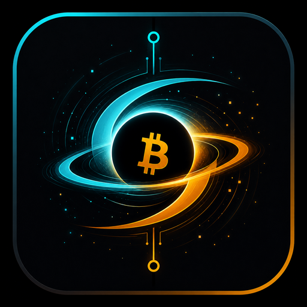
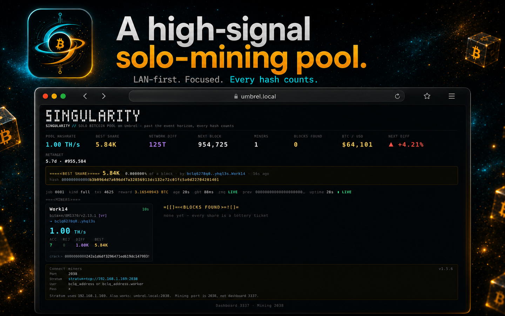
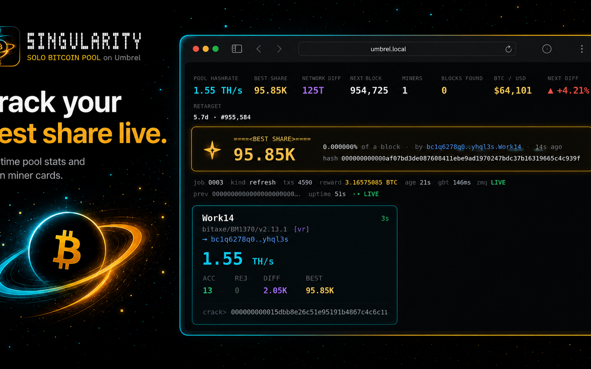
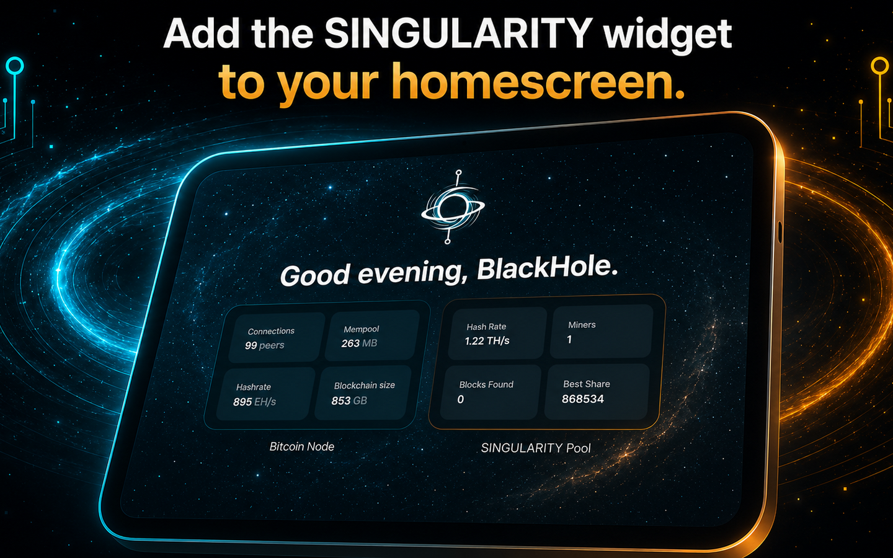

<div align="center">



# ◉ SINGULARITY Pool

### Zero-fee solo Bitcoin mining pool for Umbrel — find the block, keep **100%**.

[](#zero-fees-forever)
[](#)
[](#install-on-umbrel-one-click)
[](#)
[](#trust-but-verify)

**Your hash. Your node. Your block. Your reward.**
No accounts, no fees, no middleman — if you solve a block, the entire reward is paid
**straight to your wallet** in the coinbase.

</div>

---

## ⚡ Why SINGULARITY

Most solo pools waste your hashpower in the milliseconds after a new block and quietly
take a cut. SINGULARITY does neither. It's built around one obsession: **never waste a
single hash, and pay the finder 100%.**

|  | SINGULARITY |
|---|---|
| 💸 **Fees** | **0%** — the coinbase pays the finder directly, no dev output |
| 🎯 **Per-miner wallets** | Every ASIC mines to **its own address** (the Stratum username) |
| ⚡ **Instant empty-job** | Pushes fresh work in **~1 ms** on a new block — miners never hash a dead tip |
| 🧮 **ckpool-accurate** | Exact BigInt share math, full AsicBoost version-rolling, vardiff |
| 🔌 **Zero-config on Umbrel** | Auto-wires to your Bitcoin node (RPC **and** ZMQ) — nothing to set up |
| 🖥️ **Live dashboard + widget** | Real-time terminal UI, per-miner stats, block-found alerts, home-screen widget |
| 🪶 **Featherweight** | Node.js, **zero npm dependencies**, ~1,700 lines, runs on a Raspberry Pi |

---

## 📸 Dashboard

<div align="center">



</div>

A single-file terminal-style dashboard: pool & per-device hashrate, best share, vardiff,
reject taxonomy, ZMQ/node health, live trends — and a **full-screen announcement the moment
you find a block**.

---

## 🚀 Install on Umbrel (one click)

> Requires the **Bitcoin** app installed & synced. RPC + ZMQ are wired automatically.

1. Umbrel → **App Store → ⋯ → Community App Stores**
2. Add this repo:
   ```
   https://github.com/BlackHole-Axe/singularity-umbrel
   ```
3. Open **SINGULARITY** → install **SINGULARITY Pool**. Done. ◉

---

## ⛏️ Point your miners

| Field | Value |
|---|---|
| **URL** | `stratum+tcp://umbrel.local:2038` |
| **Worker / Username** | **your Bitcoin address** (`bc1q...`) — optionally `ADDRESS.workername` |
| **Password** | anything (`x`) |

Each miner that uses its **own address** as the username is paid directly if it finds the
block. Run 17 ASICs with 17 different wallets — every connection gets its own coinbase,
its own extranonce space, and its own dashboard card.

---

## 🧠 How it stays fast where it matters

A solo pool can't change luck — block-finding is pure probability per hash. What it *can*
do is make sure **no hash is ever wasted**:

- **ZMQ `hashblock` → instant empty-subsidy job** pushed to all miners *before*
  `getblocktemplate` even returns. Your fleet is mining the new tip in ~1 ms.
- **Full template** follows immediately, refreshed every 30 s, clean only on tip change.
- **Block-first submit:** the block check runs *before* the share-difficulty check, and a
  candidate on a just-stale tip is still submitted (orphan-race insurance).
- **Vardiff** targets 1 share / 8 s per device, with a grace window so no share dies to a
  retarget.

When you find a block, mempool.space shows it tagged **`SINGULARITY on Umbrel`**.

---

## 🔬 Trust, but verify

This isn't a black box:

- **30/30 automated tests** — coinbase bytes, merkle branch, BIP34, witness commitment,
  difficulty math, vardiff, reorg/outage recovery, and a full **end-to-end miner that mines
  real blocks** validated by an *independent* parser.
- **Node-grade consensus self-audit** every 10 min — your own `bitcoind` certifies that any
  block you find **will be accepted**, and shouts loudly in the logs if anything is ever off.
- **Full API surface** on the dashboard: `/api/state`, `/api/diag`, `/api/logs`, `/events`.

---

## ❤️ Support the developer

SINGULARITY is free and **stays 100% zero-fee** — blocks always pay *you*. If it brings you
luck and you'd like to say thanks, donations are welcome (entirely voluntary):

```
bc1q6278q0a0ttmhjc0jhhaut6ekk2waf045yhql3s
```

---

<div align="center">

**◉ past the event horizon, every hash counts**

Built for Umbrel + Bitcoin Core · Node.js · zero dependencies · MIT

</div>
# singularity-umbrel
# singularity-umbrel
